# Reversi AI Lab

Reversi AI Lab started as a browser version of a classic strategy game, but it quickly became something bigger.

I did not want to build just another playable Reversi clone. I wanted to turn the game into a small environment for strategy, experimentation, and analysis — something you can play, inspect, compare, and learn from. The result is a web application that combines a full Reversi experience with multiple AI opponents, post-game analytics, and a dedicated Simulation Lab for AI-vs-AI benchmarking.

At its core, this project sits at the intersection of gameplay, analytics, and product thinking. It is part strategy game, part AI sandbox, and part data-driven interface.

## Overview

The project is built with Python, Flask, and vanilla JavaScript, and is structured as a multi-page product rather than a single game screen. It supports regular gameplay, strategy benchmarking, replayable finished matches, and move-by-move analysis inside one connected experience.

What makes it interesting to me is that the same system can be approached from different angles. You can open it as a game, as a strategy comparison tool, or as an interface for exploring how different AI approaches behave under the same rules.

## What the Project Includes

### Gameplay

The Play page supports both local PvP and Player vs AI matches in a browser-based interface. The full game loop is handled end to end, including legal move detection, pass handling, score tracking, game-end logic, move history, replay support, and undo where appropriate.

Rather than treating the match as something that disappears once it ends, the app keeps the finished game meaningful. A completed match can be replayed, reviewed, and analyzed instead of just restarted.

### AI Opponents

The built-in AI ladder is designed to feel like a progression rather than a single computer mode.

- **Easy — Random**  
  A simple baseline opponent that chooses any legal move.

- **Medium — Greedy**  
  Focuses on immediately strong-looking moves, especially corners and local gain.

- **Advanced — Hybrid**  
  Uses a broader heuristic mix that weighs positional strength more carefully.

- **Hard — Minimax**  
  A search-based opponent built to offer the strongest built-in challenge.

Behind the scenes, the project also supports headless AI-vs-AI simulations for repeated benchmarking. That made it possible to go beyond “which bot feels stronger” and actually measure matchup behavior across batches of games.

### Post-Game Analytics

One of the main ideas behind the project was that finished matches should be inspectable.

After a game ends, the Play page exposes a post-game analysis layer with summary metrics and progression charts. Instead of only showing the final score, the app tracks how the match developed over time through views such as:

- board control over time
- weighted flips over time
- flips per move
- flip ratio over time

This turns each game into something that can be studied, not just completed.

### Simulation Lab

The Simulation Lab is the part that pushed the project beyond a standard game build.

It allows repeated AI-vs-AI benchmark runs directly in the browser, with progress updates, current-run summaries, and remembered comparisons across runs from the same session. The Lab makes it possible to compare strategies in a more structured way through chart views, dominance summaries, matchup matrices, and one representative measured game per remembered run.

In other words, instead of asking “which AI is better?” in a vague way, the project gives you a workspace for testing that question.

### Product and UX Layer

I wanted the app to feel like a real small product, not a classroom demo hidden behind one page.

That is why the project is structured around separate surfaces for Home, Play, Simulation Lab, and Settings. It includes onboarding guidance, local preference persistence, AI difficulty explanations, replay tools, and metric interpretation support inside the interface itself.

That product layer matters to me just as much as the engine underneath it. A technically strong system becomes much more valuable when it is also readable, explorable, and usable.

## Why I Built It

Strategy games are a great sandbox for algorithms and evaluation logic because they create clear rules, measurable outcomes, and meaningful tradeoffs. Reversi is especially interesting in that sense because position, timing, mobility, and tactical swings all matter at once.

I built this project as a way to bring several interests together in one system: AI, analytics, optimization, product design, and technical clarity. The goal was not only to make the game work correctly, but to make the system understandable from the outside. That meant treating benchmarks, comparison tooling, and post-game analysis as real features rather than developer-only extras.

From a portfolio perspective, this is the kind of work I want to keep doing: systems that are technically rich under the hood, but still shaped around usability, interpretation, and clear structure.

## Tech Stack

- **Python**
- **Flask**
- **Waitress**
- **HTML**
- **CSS**
- **Vanilla JavaScript**
- **pytest**
- **Custom game engine and AI strategy heuristics**

## Local Setup

For installation, launch instructions, and troubleshooting, see:

- [Local Setup Guide](local-setup.md)

## Testing

Run the test suite with:

```bash
python -m pytest reversi/tests
```

## Project Structure

```text
reversi/
  backend/
    api/
      routes.py
    engine/
      board.py
      game_state.py
      simulator.py
      strategies/
  frontend/
    static/
      app.js
      lab.js
      preferences.js
      settings.js
      style.css
    templates/
      base.html
      home.html
      play.html
      lab.html
      settings.html
  docs/
  tests/
run.py
wsgi.py
requirements.txt
install_requirements.bat
play_reversi.bat
```

## Screenshots

### Home / Landing Page

The Home page introduces the app as more than a playable Reversi clone. It frames the project as a connected product with gameplay, benchmarking, and analytics working together.

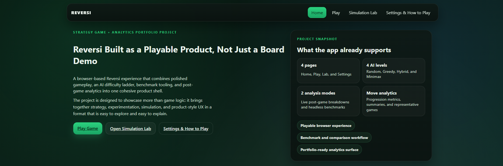

*Portfolio-style landing page with direct navigation to gameplay, simulation benchmarking, and settings.*

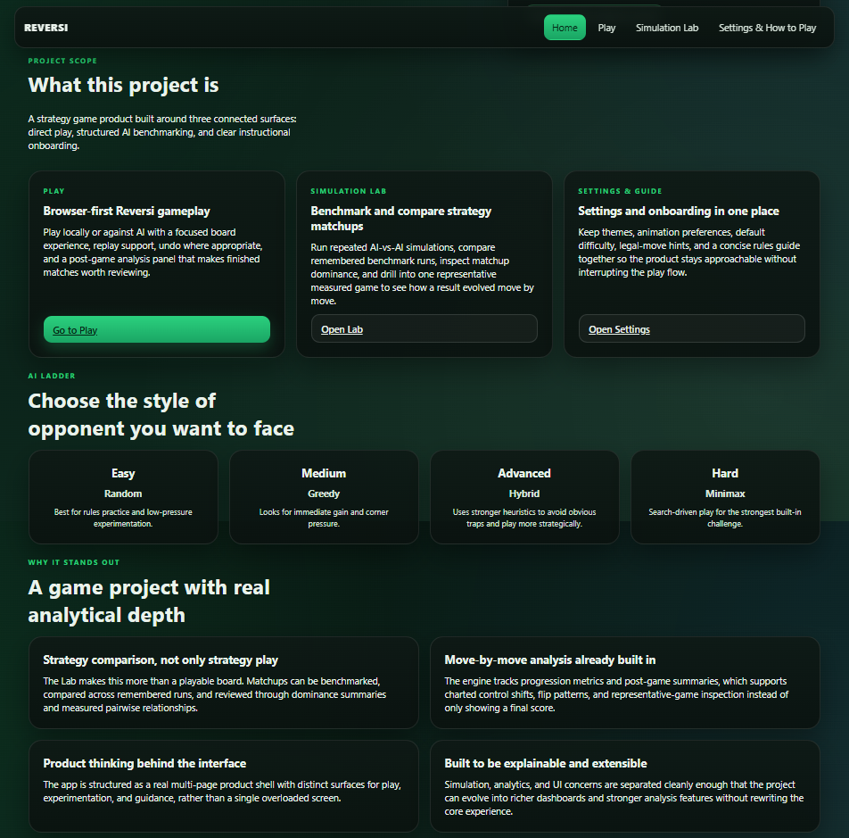

*Home page overview presenting the product structure, AI ladder, and analytical focus of the project.*

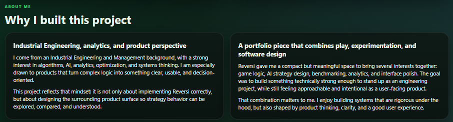

*Project motivation section explaining the engineering, analytics, and product perspective behind the build.*

### Play Page

The Play page covers the full gameplay loop: setup, live board interaction, move tracking, and replay support for completed games.

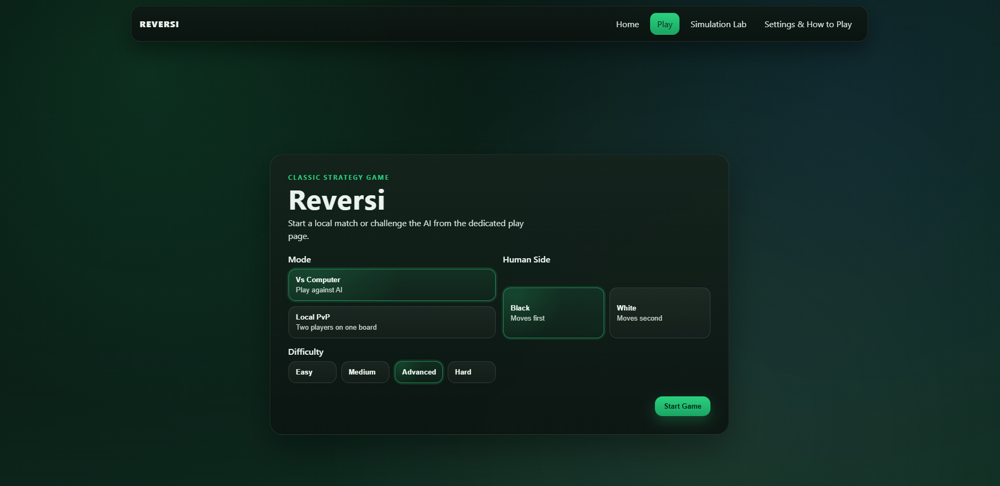

*Play setup screen with mode selection, side choice, and AI difficulty controls.*

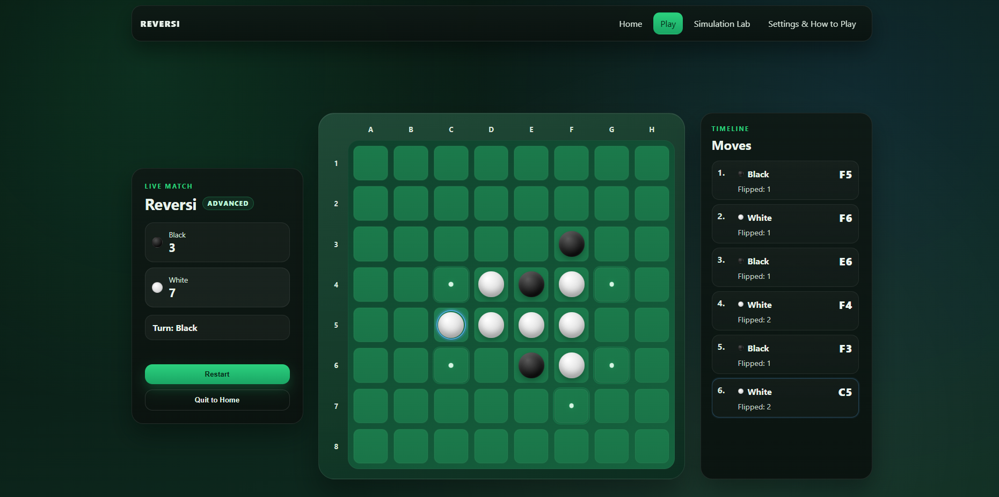

*Live match view showing the board, current score, active turn, and move timeline with flip counts.*

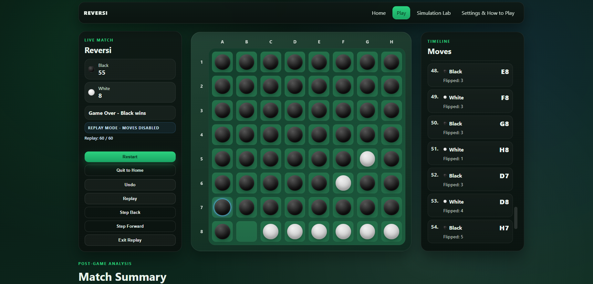

*Replay mode for reviewing completed matches move by move with synchronized board and timeline history.*

### Post-Game Analytics

Finished games transition into an analysis surface with summary metrics and progression charts, making each match something that can be reviewed rather than only observed.

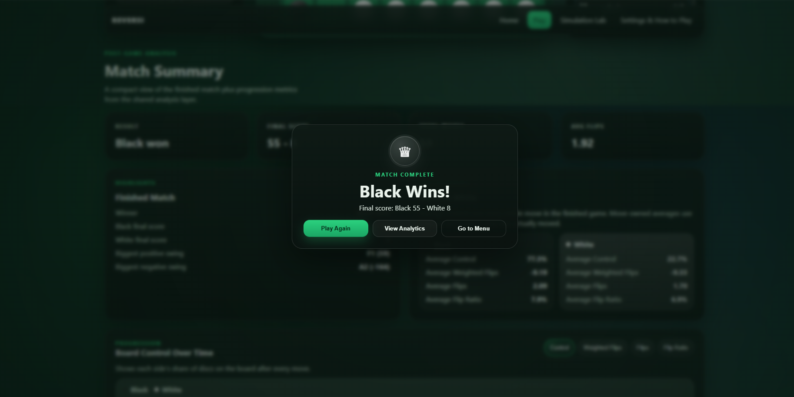

*Completed match view with final board state, replay controls, and post-game summary access.*

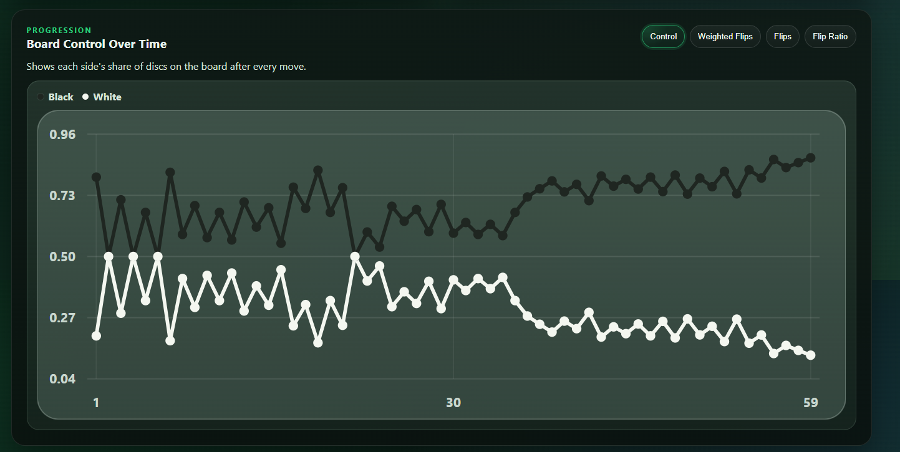

*Post-game progression chart showing board control over time across the full match.*

### Simulation Lab

The Simulation Lab turns the project into an experimentation workspace rather than only a game. It supports repeated benchmark runs, live progress tracking, and structured comparison between strategies.

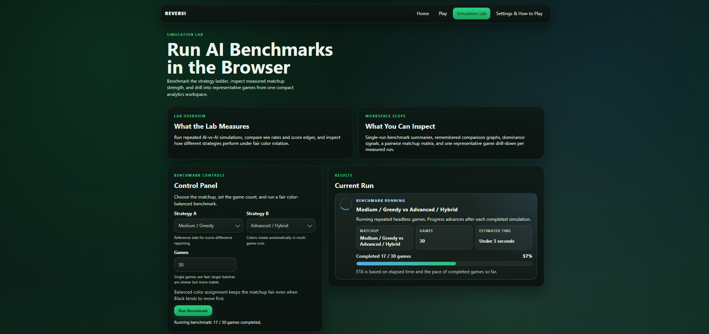

*Simulation Lab overview with benchmark controls, live progress tracking, and current-run status.*

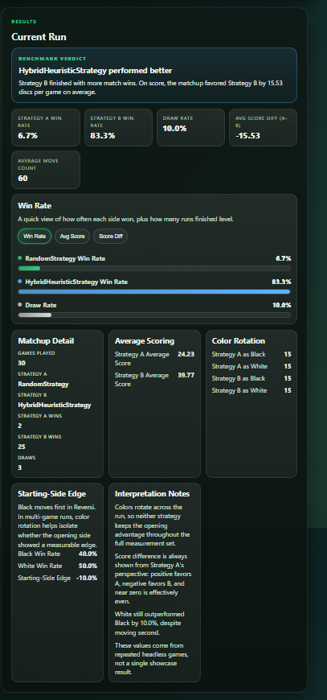

*Single benchmark result view summarizing win rates, score differential, move count, color rotation, and interpretation notes.*

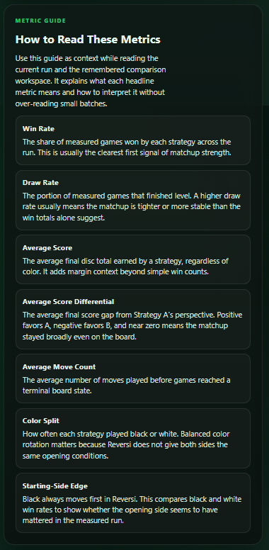

*Built-in metric guide explaining benchmark statistics and helping users interpret matchup results.*

### Matchup Matrix / Representative Breakdown

Remembered benchmark runs can be reviewed side by side through summary rankings, chart views, pairwise matchup inspection, and one representative measured game per run.

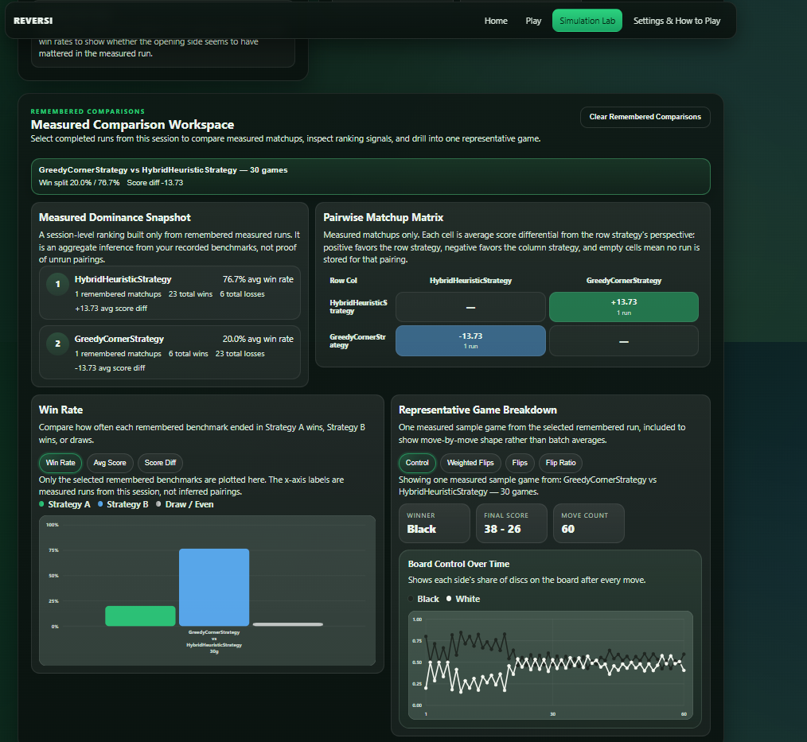

*Remembered comparison workspace for reviewing stored benchmark runs, dominance signals, matchup matrix results, and representative-game drill-down.*

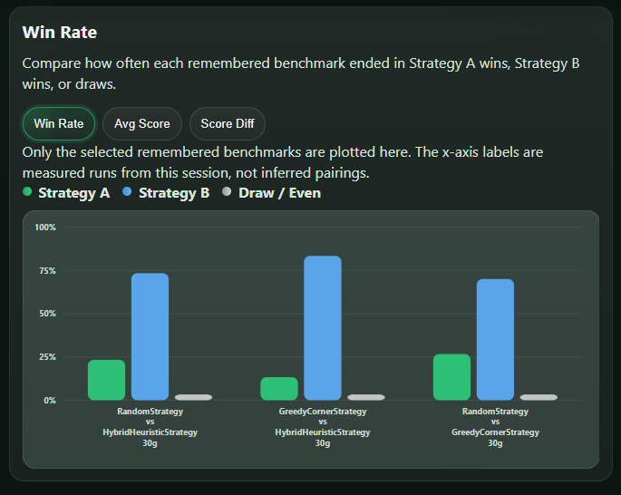

*Comparison chart view showing how remembered benchmark runs differ in win-rate outcomes across strategy matchups.*

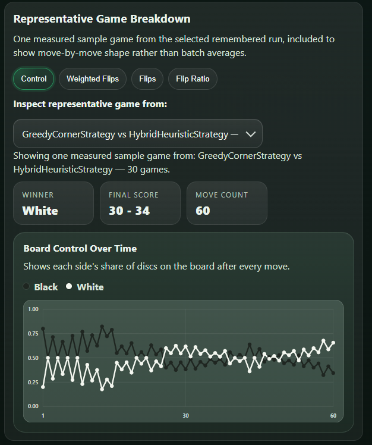

*Representative game breakdown with move-by-move board-control analysis from a measured benchmark run.*

### Settings & How to Play

The Settings page rounds out the product surface by combining local gameplay preferences with onboarding guidance and AI difficulty explanations.

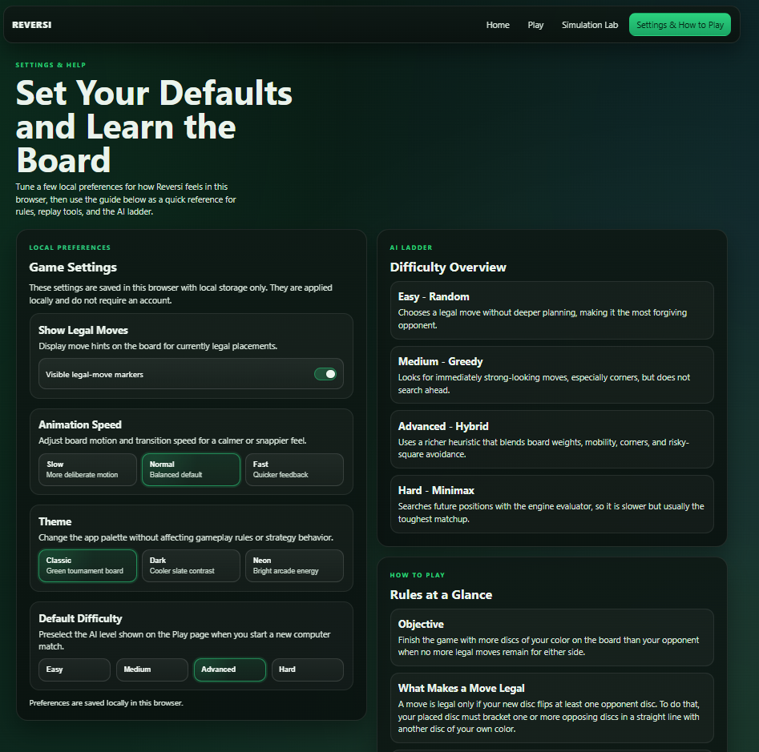

*Settings and onboarding page with local preferences, AI difficulty explanations, and a built-in gameplay guide.*

## Documentation

Additional project notes are available in:

- [Architecture Notes](ReversiGame/reversi/docs/architecture.md)
- [API Notes](ReversiGame/reversi/docs/api.md)

## Future Improvements

There are still several directions I would like to take this project.

- richer strategy presets and experimental configuration controls
- exportable benchmark summaries
- tournament or ladder mode for repeated AI competitions
- deeper visual analytics in the Lab
- persistent benchmark storage through CSV export or relational SQL database integration
- predictive modeling for estimating game outcomes based on strategy pairing and starting side
- packaged desktop-style release for easier local distribution
